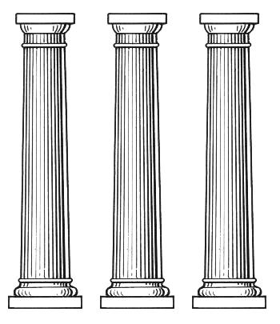

# Reviews and Social Dynamics

# Code Review
* Accepted as powerful tool
  * Quality Assurance
  * Knowledge Transfer
  * Team participation

# Tool support
* Reviewboard
* github pull request
* gitlab merge request
* email patches
* etc.

# Reviews
* Who reviews other peoples work?
* whose work is reviewed?

# Reviews and Conflicts
* Reviews frequently cause conflicts
* often little relation to technical issues  
  -> endless discussions  
  -> reluctance to contribute

# Why?

# Self-Worth 

(A Model)

# Self-Worth
* Important part of mental wellbeing
* low self-worth associated with mental issues
    * e.g. Depression

# Three Pillars
**Self-worth** -
**Idols** -
**Consciences**

# Consciences
* I am good because I do good
    * Moral Codes
    * Doing good work
* Strengthened through Recognition from others

# Back to Reviews
* Judging my Code  
  => Judging me?  
  => I will defend my self-worth!
* Technical Discussions become personal
* cannot be resolved on technical level

# Responsibility
* We are given great Power

# What can we do?
* Acknowledge the responsibility
* Praise generously
* Don't review while angry
* Avoid "you" statements
* reframe requests as questions  
    "what do you think about x?"

# Further Reading
* Stavros Mentzos - Lehrbuch der Psychodynamik
